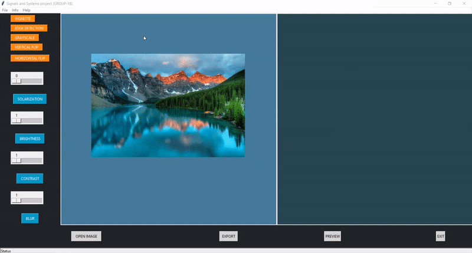

# Project Title
The application of Mini-Photoshop demonstrates execution of several different kinds of filters over images of any dimension and allows users to save the execution in their PC later.

Mini-Photoshop helps the user in 
- to modify the look of an image
- beautify and style it as per his/her requirements.
- Extract details from the image

Following are the filters that can be applied to an image in mini-Photoshop:

1. Brightness
2. Contrast
3. Solarization
4. Blur
5. Grayscale
6. Horizontal Flip
7. Vertical Flip
8. Edge Detection
9. Vignette 


## Run Locally

Clone the project

```bash
  git clone https://github.com/gauravbajaj27/Mini-Photoshop
```

Go to the project directory

```bash
  cd Mini-Photoshop
```

Install dependencies

```bash
  pip install -r requirements.txt
```

Start the server

```bash
jupyter notebook
```
Open Mini_PhotoShop.ipynb and select Kernel>Restart & Run All

  
## Features 

Below are the screenshots of the few filters of the mini-photoshop application:

Applying Greyscale Filter to the image


Increasing brightness of Image and Saving the image

## Documentation

Below is the detailed report containing the explanation and working of each filter along with screenshots of images conversion and algorithms behind the conversion.

[Project Report](https://drive.google.com/file/d/1TJzC23BVf4Etn3dWEcs1pAyvF5AqQIsq/view?usp=sharing)

  
## License

[MIT](https://choosealicense.com/licenses/mit/)

  
## Authors

- [Gaurav Bajaj](https://github.com/gauravbajaj27)
- [Shubham Jain](https://github.com/Jimmy290901)
- [Abrar Savan](https://github.com/abrarsavan)
- Maanas Bhardwaj


  
